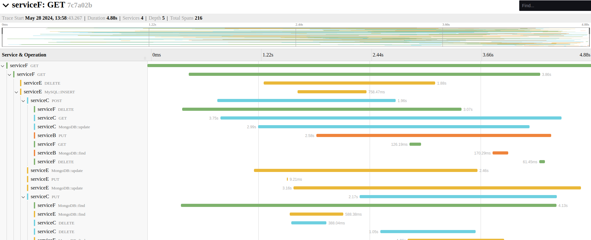

# Trace View

An attempt to compile the component trace with spans.Based on the components [jaegerui] (https://github.com/jaegertracing/jaeger-ui/tree/de8b0220cfd285B14DE9CDB77A4B35C07FC306).There is [Issue] (https://github.com/jaegertracing/jaeger-ui/issues/508) Where the guys from Grafana tried to find a solution how to re-use the `Trace` component.Their decision was FORK.I took the code from the Grafana repository, taking the code at the time of the integration of the `Trace 'component into their project, [Issue] (https://github.com/grafana/grafana/issues/54027).

## Screenshot



## Examples

There are examples of use in the folder `Examples`.

Before assembling an example, execute the command:

```bash
npm run build
```

## References

- [Grafana jaeger-ui components](https://github.com/grafana/grafana/tree/f1295e4bd020ac5d5df41b1ca79aec3f04d1ec40/packages/jaeger-ui-components)
- [Jaeger-UI](https://github.com/jaegertracing/jaeger-ui/tree/de8b0220cfd285b14e4de9cdb77a4b35c07fc306)
- [issue: Extract TracePage components](https://github.com/jaegertracing/jaeger-ui/issues/508)
- [issue: TraceView: Refactor](https://github.com/grafana/grafana/issues/54027)
